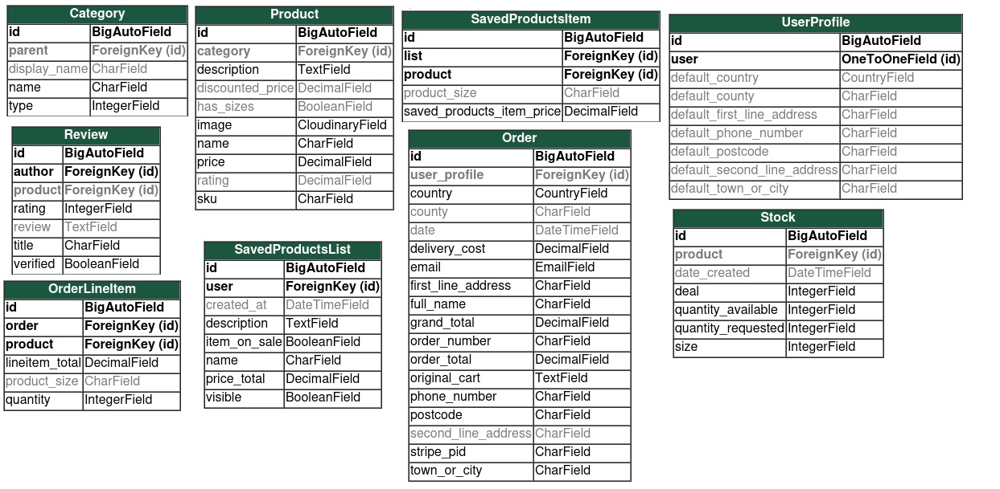
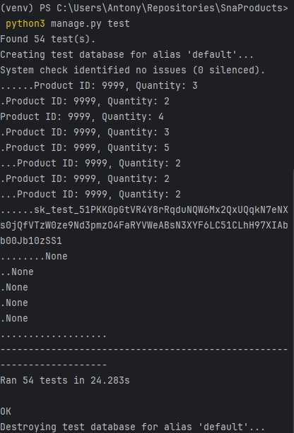

# E-commerce website

**Deployed website: [Link to website](https://snaproducts-5c3a2d36af92.herokuapp.com/)**

## About

"SnA Products" is an e-commerce website that allows customers to purchase homeware items for delivery.
It provides a seamless experience with its login system, shopping cart, checkout system, 
and secure payment system. On-top of this, SnA Products features a comprehensive personnel system tailored for administrators. This system grants admins full control over managing the website's operations, including user account administration, products to be displayed and category management. With a focus on user experience and efficient backend management, SnA Products aims to redefine the way consumers shop for homeware.

---
## UX

The website was created to be user-friendly with an obvious flow. The user is presented with clear pathways as they work through the site. The website is designed to be easy to use and easy to understand. The buttons are colour codes throughout the site, creating less friction for the user. Additionally, the website attracts customers to become a part of newsletter program.

### Target Audience

This online homeware store is aimed at any potential customers who are looking to furnish their home, as well as upgrade products they already have.

### Planning
#### Models
When planning the models I created an ERD for each model. This helped to visualise what was going on in the database, and how it can be manipulated for each task.

I made sure to note what type each field was going to be and how they linked with other models.

#### Wireframes
Before creating any template, I first made sure to plan what the page was going to look like on mobile, and computer. I did this by creating a wireframe of each page. While the wireframes don't match the website exactly, it gave me a good idea of where to start.
When planning each page, I researched big department online stores to get a good idea of what works well, also noting what are the things I didn't like as a user, and how I could improve them.
My aim was to make the website as easy to use as possible, as people of all ages and backgrounds might like to use the store.

[Link to Wireframes](documentation/wireframes.md)
### User Stories

#### Shopper

| Issue ID                                                    | User Story                                                                                                                                 |
|-------------------------------------------------------------|--------------------------------------------------------------------------------------------------------------------------------------------|
| [#2](https://github.com/antonychalks/SnaProducts/issues/2) | As a logged in shopper, I can create, edit and delete lists of products so I can save products for purchase another time.                  |
| [#3](https://github.com/antonychalks/SnaProducts/issues/3) | As a shopper I can view a list of products, based on what filters I would like to apply, in the order I want, to find the products easily. |
| [#4](https://github.com/antonychalks/SnaProducts/issues/4) | SHOPPER STORY: Easily find all the sales and deals on the site. |
| [#23](https://github.com/antonychalks/Django-Blog/issues/23) | As a shopper I can view each individual products details so that I have all the information before purchasing.                             |
| [#25](https://github.com/antonychalks/Django-Blog/issues/25) | As a shopper I can view the basket value and list of basket items so that I can track how much I'm spending.                               |
| [#27](https://github.com/antonychalks/Django-Blog/issues/27) | As a shopper I can use the search bar to find the products I want.                                                                         |

#### Super User

| Issue ID                                                      | User Story |
|---------------------------------------------------------------|-------------|
| [#1](https://github.com/antonychalks/SnaProducts/issues/1)   | As a super user I can add, edit and delete products on the website so that the products can stay up to date with the companies needs.|
| [#5](https://github.com/antonychalks/SnaProducts/issues/5)   | As a super user I can add, edit and delete categories on the website so that the categories can stay up to date with the companies needs.|
---
### Applications
In this section, I am going to list each application in this project, and describe its purpose and how it works.

1. #### Landing page
This application is created for the sole purpose of rendering the initial landing page for the user. It renders the landing page template which gives each user the option to browse the various categories, log in, sign up or sign up to the newsletter with the pop-up.

2. #### Cart
This application is used to manage the cart. The cart application implements the functionality to view the cart, add items to the cart, remove them from the cart and update the quantity of the cart.

The items in the cart are added, updated and deleted by allowing the user to submit POST requests which will be sent to the cart_contents context that is saved in the user's session. This allows users to keep track of what items are in their cart, what quantity and size.

Viewing the cart also allows the users to find out what items are saved, as well as the quantity and size of each product. Other valuable information is also displayed to the user such as the delivery cost and how much is left for a discounted delivery, or if the user has already passed the minimum delivey threshold, they will be able to see this here.

From here, the user can either keep shopping or check out their cart if they are finished shopping.

3. ####  Checkout
The Checkout apps purpose is to compile, process and complete the purchase using the items in the cart.

Firstly, the website gathers the information in the cart to find out what items have been requested, along with any item sizes.

These items are then compiled into an order. The website will ask the user to input their shipping details, such as their name, contact details and address. 

The user must also input their card details, so they can be checked by the stripe authorization system.

After this, the user can check out. This will send all the shipping details and billing details to stripe to confirm the payment. Once the payment is confirmed stripe will send back confirmation to the websites backend, and the user will be directed to the checkout success page, as well as being sent a confirmation email.

Using the Django admin page, any super users are able to add, edit or delete any orders, as well as any line items within the order.

4. #### Products
The purpose of the products app is to manage all the products and categories that are available on the site, and display the products to the user, with filters and sorting options.

Firstly, a list of the products created by the products model is rendered onto the screen when the user goes to the product page. To find a specific product, the user can use the search bar, which will search each product for the user inputted keyword. 

Another option the user has is to filter by category, which allows the user to find a range of stuff, organized into different rooms in the house, along with sub categories for each room.

The user can also sort all of the products on the page by price, rating, name and category in ascending or descending order.

When a user clicks the product, they will be shown to a product detail page, which shows the user all the details the website has on each product, with the option to add each product to the their basket after selecting the desired quantity.

Superusers also have the availability to go to the manage products page, which displays a list of all the products, which the superuser can search, sort and filter through.

On both the manage products page and the list products page (when signed in as a super user), there are buttons to update or delete each product.

Superusers can also add, edit and delete categories from the site, as well as adding new products, all done on the manage products page.

5. #### Profiles
The profiles app creates the ability for each user to save shipping and contact details to enable them to checkout faster.

Whilst users don't have to be signed in to use this website, if they are, they have the availabilty to save their contact details to the website. This means that next time they make a purchase, the checkout system will go a lot quicker as they won't have to re-enter their shipping details. This reduces friction on the site and creates and user-friendly experience.

Superusers can add, edit and delete user profiles from the Django admin page, as well as validating accounts.

6. #### Saved Products
The saved products app allows the user to save lists for another time.

Users can save multiple products to multiple lists, enabling them to save products for later if they don't want to purchase them yet.

Each list will display the current price of the item, as well as the quantity of the product and all the products details.

Products can be added to lists from the product list page or the product detail page.

Lists can be made public or private which allows users to create a birthday or Christmas list to share with others.

Lists can be edited, deleted or new ones added from the list page, as well as new lists created.

---
## Business Model

SnA Products operates on a B2C business model, catering to people of all ages and backgrounds. The focus lies on individual transactions, ensuring a seamless experience from browsing to checkout.

### A Persona Summary of the customer

SnA Products targets a wide range of consumers, acknowledging their diverse preferences and interests. With no limits to who can use the site, the platform aims to deliver exceptional service by facilitating easy navigation, presenting a wide range of products, and prioritizing user satisfaction.

### A persona summary of the store personnel

SnA Products serves as a platform for the SnA Products business to interact with their customers without any distributers. This allows SnA Products to gain valuable feedback and data of what products the customers enjoy, and which products to stop investing in.

---

## SEO and Marketing

Please see  [SEO and Marketing](documentation/SEO_MARKETING.md) for an extensive overview of the marketing research for this project.

---
## Future Development

#### Payment system
I want to implement PayPal payment system in the future as many customers prefer to use it.

#### Featured Products

I will be implementing a featured products feature, which will display on various pages, showing users a range of products available on different parts of the site. 

#### Deals and discounts

I would like to implement deals and discounts in the future which will allow store admins to apply discounts to products of their choosing, as well as deals when buying sets of products.

---

## Technologies used
- ### Languages:
    
    + [Python](https://www.python.org/downloads/release/python-385/): the primary language used to develop the server-side of the website.
    + [JS](https://www.javascript.com/): the primary language used to develop interactive components of the website.
    + [HTML](https://developer.mozilla.org/en-US/docs/Web/HTML): the markup language used to create the website.
    + [CSS](https://developer.mozilla.org/en-US/docs/Web/css): the styling language used to style the website.

- ### Frameworks and libraries:

    + [Django](https://www.djangoproject.com/): python framework used to create all the logic.
    + [jQuery](https://jquery.com/): was used to control click events and sending AJAX requests.
    + [jQuery User Interface](https://jqueryui.com/) was used to create interactive elements.

- ### Databases:

    + [SQLite](https://www.sqlite.org/): was used as a development database.
    + [ElephantSQL](https://www.elephantsql.com/): the database used to store all the data.

---

## Testing

### Manual testing
The website was manually tested by myself, and a group composed of my family and friends for the following categories.

1. **Browser compatibility**: Manually test the website on multiple browsers (Chrome, Firefox, Safari, Edge etc.) to ensure compatibility.

2. **Responsiveness**: Check the website's responsiveness on different device resolutions. Ensure elements resize and reposition correctly when the browser is resized.

3. **Forms**: Test all forms by filling out the inputs and submitting them. Check validation for each input, including tests for incorrect input.

4. **Navigation**: Ensure that all navigation links direct to the correct page. Manually click on each link and button to confirm.

5. **Performance**: Manually measure load times and latency.

6. **Search Functionality**: Assure that website's search returns adequate and correct results.

7. **User Authentication**: Validate the login and sign-up functionalities to work properly, including error messages for incorrect replies.

8. **Error Messages**: Check if appropriate error messages are displayed for different scenarios.

9. **Data Integrity**: If data manipulation operations are performed, ensure the database is accurately updated.

### Automated testing
When automating testing, I used a Python standard library module: unittest.

This was done by creating a test file for each file that was being tested within each app. For example, in the products app, a test case was created to test the views and forms used within the app.

Within each file there is a test case, which runs all the test within the case. Each test case has a set up function, which creates a test instance of any model the test might need. This prevents the database actually being manipulated whilst running tests.

Throughout this project I ran the tests multiple times as I went, fixing all the errors and failures whenever they present themselves. This helped to ensure nothing was missed in the functionality of the website.
#### Testing views
When creating a views test, I would first check the correct status code was returned which shows the page is being loaded correctly.

After this I will look at each view, and what the aim of the view was.

For example, on the list products view, the aim was to display all the products, them be able to filter, sort and search through the products.

To test this example, I first tested the page would render, then I created a test for each sort option, by checking the first result is the expected result. I.E. When setting the sort to price, I tested the first product on the list had the lowest price.
After this I went created tests to ensure only the correct products were being shown when using the filter, as well as ensuring the search results returned the correct products.

#### Testing Forms

All form validations are thoroughly tested to verify correct error messages are displayed for invalid user inputs. In case of third-party integrations like payment processors, they are mocked to simulate and test different scenarios.

#### Running Tests
You can run the test suite with the following command in your terminal:
_python3 manage.py test_

The last time tests were run, there were no errors or fails.

## Deployment

This website has been deployed using Heroku.

Instructions to deploy using Heroku:

1. While in Heroku, navigate to dashboard and then click on the new button in the top right corner choosing: create new app.

2. Input a name for your app (this name will need to be unique) and choose the correct region for where you are located. Click create app.

3. Your app has been created, now click on the settings tab.

4. Click reveal config vars to add any keys the application will need. For this project I added:
- All the key value pairs from my env.py file.

5. Click add buildpack to install any interdependecies needed. For this project I installed 'python'.

6. Click on deploy tab. Select deploy method, in this case Git Hub. Confirm connection to git hub by searching for the correct repository and then connecting to it.

7. To manually deploy project click 'Deploy Branch'. Once built a message will appear saying: Your app was successfully deployed. Click the view button to view the deployed page making a note of it's url.

8. You can also set up automatic deployment.

9. If you find your css is not showing correctly on the deployed site running the following command while in your workspace may help:
./manage.py collectstatic

10 - Don't forget to turn Debug back to False before final deployment.

## Cloning this repository

In order to work on this repository you will first need to clone it.

**Instructions to clone the repository**:

1. While in the GitHub repository, click on the green code button.

2. Copy the link.

3. In your IDE or local coding environment use the link to open the repository. 

For example: in VScode 
- clicking on 'Clone Git Repository...' will bring up a box in which to paste the link. 
- once vscode has the link, you will then be asked where you would like the repo saving.
- You should now be set up ready to work on the repository.

For example: in CodeAnywhere
- Click on 'Add new workspace'
- You will then be given the option to 'Create from your project repository' and a box in which to paste the link
- CodeAnywhere will now open a new workspace containing the repository.
- You should now be set up ready to work on the repository.

4. Import all dependencies. I use the command: pip3 install -r requirements.txt.

5. Create an env.py file in the main directory.

6. Enter key data, such as: DATABASE_URL, SECRET_KEY, CLOUDINARY_URL

7. Check that env.py is named in the .gitignore file.

8. In settings.py change Debug to True while developing. You make also want to change to Django's inbuilt sqlite database.

9. Add the following code to settings.py:

COMPRESS_ROOT = BASE_DIR / 'static'

COMPRESS_ENABLED = True

STATICFILES_FINDERS = ('compressor.finders.CompressorFinder',)

10. Check it's all working by running the program. I used the command:
python3 manage.py runserver

## Forking a branch

In order to protect the main branch while you work on something new, essential when working as part of a team or when you want to experiment with a new feature, you will need to fork a branch. 

**Instructions to fork the repository**:

1. While in the GitHub repository, click on the branch symbol and text indicating the number of branches.

2. This will load details on current branches. Click on the green 'New branch' button.

3. Enter a name for the new branch and then click the green 'create new branch' button.

4. Your new branch should now have appeared on the screen.

5. Clicking on the new branch and then following the steps for cloning will allow you to open up and work on this branch.

**Instructions to fork directly from an issue**:

1. Click to view an issue, either from the issues list or from the project board. From the project board you will need to click once to bring up the issue and then again on the title to go into it fully.

2. Partway down the right hand side (on desktop) you should see the heading 'Development' and under this a link to 'create a branch for this issue or link a pull request'.

3. Click on the link to create a forked branch that is tied to the issue.

## Credits
- All credits are displayed in [credits.txt](documentation/credits.txt).
- As well as this, a lot of functionality was inspired by the Boutique_Ado code along project created by [Code_Institute](https://codeinstitute.net/).
